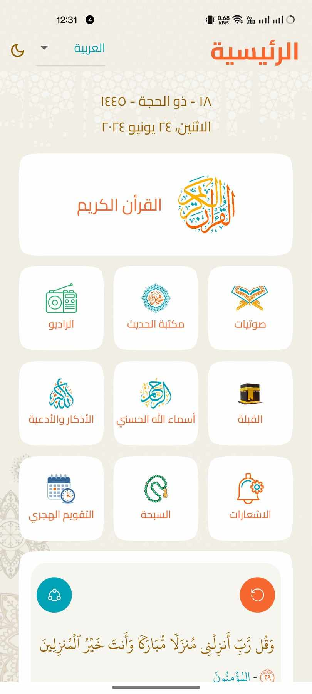

# Skoon - Flutter Islamic App

<div style="display: flex; justify-content: space-around;">
  
  
  
  
</div>

## Overview

Skoon is a comprehensive Islamic app built with Flutter. It offers a variety of features including Quran, Hadith, Quran audio, radio, the 99 names of Allah, Duaa, and more.

## Features

- **Quran**: Complete Quran text with translations and tafsir.
- **Hadith**: Access to a collection of Hadith from various sources.
- **Quran Audio**: Listen to Quran recitations by different Qaris.
- **Radio**: Live streaming of Islamic radio stations.
- **99 Names of Allah**: Learn and reflect on the 99 beautiful names of Allah.
- **Duaa**: Collection of daily and special occasion supplications.
- **And more**: Additional features to enhance your Islamic knowledge and practice.

## Getting Started

To get started with the Skoon app, follow these steps:

1. **Clone the repository**
   ```sh
   git clone https://github.com/Epic-Apps-Hub/Skoon-Flutter-Islamic-App
